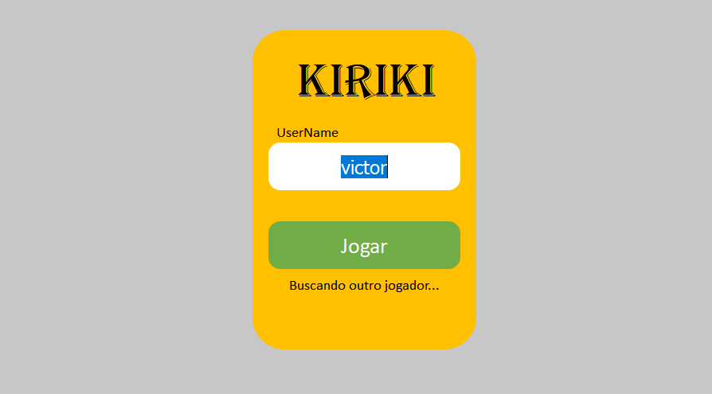
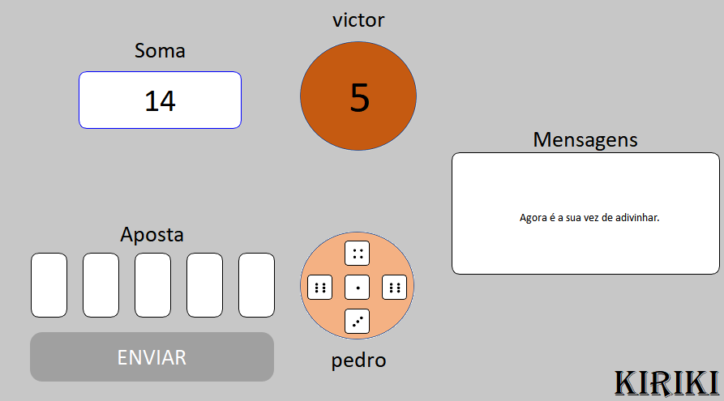

# kiriki

A game of dice and guessing.

## To run the server

Read the [README.md](./server/README.md) file from the `server` directory.

## To run the client

Read the [README.md](./Client/README.md) file from the `client` directory.

## The Game

First enter a username, which will identify you during the game. After that, the game will look for a second player, and when it finds him, the game will start.

## Rules

The game consists of guessing the opponent's dice, having as information the number of opponent's dice and their sum.

- If you get all the guesses right, you win.

- If you hit more than half of the guesses, the game's turn passes to the opponent.

- If you hit less than half of the guesses, you will have to eliminate one of your dice (by clicking on one of them) and the game's turn will pass to the opponent. In this case, you will increase your opponent's chances of winning on the next guess.

The game will continue until someone gets all the guesses right or one of the players has only one die.

