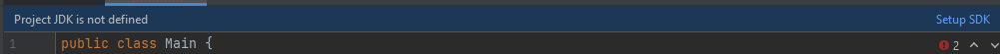
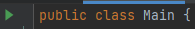

# Kiriki - Server

This is an IntelliJ java project.

## Defining the SDK Project

(Recommended SDK version: 8 or later)

- Open the `server` directory in IntelliJ.
- Go to `server/src/Main.java`, click setup SDK and choose your SDK version.

- Alternatively, you can setup SDK by going to `File > Project Structure > Project SDK` and choosing an option.

## Running the project

To do this, just click on the green arrow next to the main class name.

If the JDK is configured correctly, the project will be built and the `out` directory will be created with the `.class` files.

After that, the server will run on the IntelliJ terminal.
